# Powercore V3

A high-efficiency power supply unit specifically designed for Electrical Discharge Machining (EDM) applications.

## Repository Structure

- `circuit-boards/` - KiCAD PCB designs for all modules
- `schematics/` - Schematic PDFs for electronics
- `KiCAD-library/` - Custom component library and 3D models
- `LTSpice/` - Simulation files
- `powercoreV3-firmware/` - Arduino firmware for the RP2040 controller

## Table of Contents

- [PSU HIGHLIGHTS](#psu-highlights)
- [FEATURES](#features)
- [APPLICATIONS](#applications)
- [GENERAL DESCRIPTION](#general-description)
- [SPECIFICATIONS](#specifications)
- [Recommended Operating Conditions](#recommended-operating-conditions)
- [DEVICE INTERFACES](#device-interfaces)
  - [Power Input Connector](#power-input-connector)
  - [Power Output Connector](#power-output-connector)
  - [Digital Interface Connector](#digital-interface-connector)
  - [USB-Micro Serial Interface](#usb-micro-serial-interface)
- [THEORY OF OPERATION](#theory-of-operation)
- [OPERATION MODES](#operation-modes)
  - [Startup Behavior](#startup-behavior)
  - [Idle Mode](#idle-mode)
  - [Iso-Frequency Mode](#iso-frequency-mode)
  - [Edge-Detection Mode](#edge-detection-mode)
- [APPLICATION EXAMPLE: MINIMUM IMPLEMENTATION](#application-example-minimum-implementation)
- [EMC & EMI](#emc--emi)
- [Images of PCBA](#images-of-pcba)
- [Typical PSU Waveforms](#typical-psu-waveforms)
- [LICENSE](#license)
- [⚠️ HIGH VOLTAGE SAFETY WARNING ⚠️](#️-high-voltage-safety-warning-️)

## PSU HIGHLIGHTS

1. Optimized for wire EDM
2. Low power consumption (<300 W) & high efficiency
3. Adjustable output parameters
   - Machining Duty Cycle: 1% - 15%
   - Machining Spark Initiation Voltage: 64V - 150V
   - Machining Frequency: 5 KHz - 20 KHz
4. USB Serial interface for configuration & telemetry
5. PWM Feedback for reporting to external feedrate control
6. Edge detection for probing

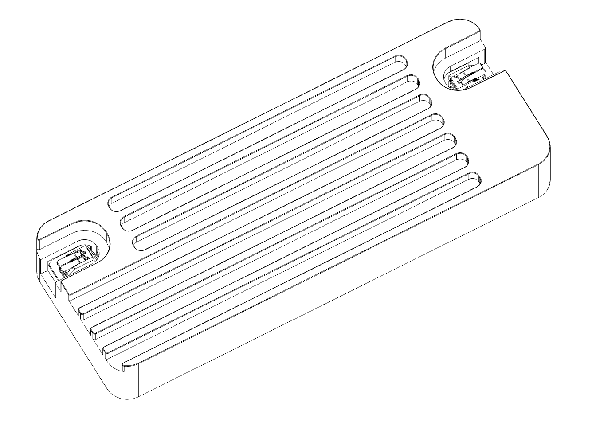

## FEATURES

- **Dual-Converter Topology** with internal resonance and boost converter for ultra-high power efficiency EDM machining
- Power consumption optimized for desktop/micro-scale wire EDM (300 watts maximum, 48VIN)
- Output parameters adjustable over USB-micro serial interface
- Smart protection features: Pulse-skipping, over-current protection, & in-rush protection
- Open-Source electronics, firmware, & CAD

## APPLICATIONS

- Wire EDM
- Plunge EDM
- Desktop scale EDM machines
- Portable & battery-powered EDM machines
- Scientific research and development

## GENERAL DESCRIPTION

The Powercore V3 provides precise control over machining parameters such as machining duty cycle, spark initiation voltage, and machining frequency. The Powercore V3 is optimized for both desktop scale wire EDM systems. Its open-source design ensures adaptability for scientific research, development, and custom EDM implementations.

## SPECIFICATIONS

| SPECIFICATION | Min | Max Value | UNIT |
| --- | --- | --- | --- |
| Average Input Power | 10 | 300 | W |
| Input Voltage | 47.8 | 48.2 | V |
| Input Current | 0.625 | 6.25 | A |
| Machining Duty Cycle | 1% | 15% | % (on/off) |
| Machining Spark Initiation Voltage | 64 | 150 | V |
| Machining Frequency | 5,000 | 20,000 | Hz |
| Machining Current (1) | 40 | 70 | A |
| PWM Feedback Duty Cycle | 0 | 100 | % |
| PWM Feedback Voltage | 0 | 3.3 | V |
| PWM Feedback Frequency  | — | 10,000 | Hz |
| PWM Feedback Output Resistance to GND | 9,990 | 1,010 | Ohms |
| Enable Input Voltage | 3 | 3.5 | V |
| Enable Input Impedance | 9,990 | 1,010 | Ohms |

(1) Machining current is dependent upon impedance of output cables and discharge, and is NOT based on a constant-current scheme. Lower-resistance output cables will afford a higher machining current.

## Recommended Operating Conditions

| Parameter | Value |
| --- | --- |
| Ambient Temperature | 0C - 30C |
| Ingress Protection Rating | IP20 (Indoors) |
| Relative Humidity | 20%-80% Non-Condensing |
| Input Cable Gauge | 16 AWG |
| Output Cable Gauge | 16 AWG, Stranded Conductor, 300V UL-Rated |
| Output Cable Length | < 1 Meter, Twisted Pair |
| Active Air Cooling | Recommended |

## DEVICE INTERFACES

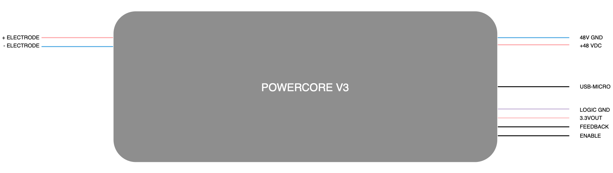

### POWER INPUT CONNECTOR

Input power is supplied to the device via a 2-position lever-action Wago connector, which accepts 16 AWG conductors. 48VDC must be connected to the device before 5V over USB-micro. If power is supplied to the RP2040 microcontroller before 48VDC is supplied to the PSU, the microcontroller will enter fault-mode and not function.

### POWER OUTPUT CONNECTOR 

The output of the device is a 2-position lever-action Wago connector, which accepts 16 AWG stranded conductors. The output cable should be twisted, and shorter than 1 meter. The output cable must be either shielded/grounded, or be contained within a shielded/grounded machine enclosure.

### DIGITAL INTERFACE CONNECTOR 

A 4-position JST-XH header enables communication with external controllers. The header exposes 3.3V and GND from the RP2040 Pico microcontroller, with current-limiting resistors in series.

- **Enable Port**: The device outputs power only when the enable port is connected to either the 3.3V port or a separate 3.3V supply sharing a common logic ground. A 10K resistor pulls the net down to GND.
- **Feedback Port**: This port reports discharge rates through an active-low PWM signal. A 100% duty cycle indicates an open circuit, while 0% indicates a short circuit or power supply error. During machining, adjust the external motion controller's feed rate to maintain a duty cycle between 20-80%. A 10K resistor pulls the net down to GND. If analog feedback is desired, an external low-pass filter can be added to this port.

### USB-MICRO SERIAL INTERFACE

The Powercore V3 exposes the USB-micro connector of the microcontroller module (Raspberry Pi 2040 Pico) for configuration of the machining parameters and the sharing of PSU telemetry. The default baud rate is 115200.

The device will NOT function unless power (5V) is supplied over USB to the micro-controller module through the USB-micro connector, and only if 48VDC is already connected to the power input Wago.

| SERIAL COMMAND | DESCRIPTION |
| --- | --- |
| SEND_TELEMETRY | Send device status & parameters over serial from the device |
| SET_ALL_PARAMETERS | Set output parameters for machining: #discharges, duty cycle, frequency, initiation voltage<br>Example: 'SET_ALL_PARAMETERS 0 0.10 5000 100' - Requests infinite discharges at 10% duty cycle 5,000 Hz 100 V<br>Example: 'SET_ALL_PARAMETERS 0 0.15 10000 150' - Requests infinite discharges at 15% duty cycle 10,000 Hz 150 V |
| EDM_ISOFREQUENCY_MODE | Enter EDM Isofrequency mode |
| EDGE_DETECTION_MODE | Enter Edge Detection mode |
| RESET_DEVICE | Reset the device |

Sending an unknown command will return a list of valid commands. 

## THEORY OF OPERATION

The Powercore V3 power supply unit is engineered for Electrical Discharge Machining (EDM), delivering precise control over the rapid cycling of spark initiation, heating, and termination. The unit generates thousands of sparks per second, seamlessly transitioning between high-voltage spark initiation and high-current spark heating, before terminating each discharge. This cycle repeats at high frequency.

**Spark Initiation Voltage**: This parameter determines the conditions for spark formation. Higher voltages produce longer, more intense sparks, ideal for machining materials such as steel. The Powercore V3 allows precise adjustment of spark initiation voltage to optimize performance for various materials.

**Machining Duty Cycle**: The duty cycle governs the duration of each spark discharge. A longer duty cycle increases the material removal rate (MRR) but may result in greater surface roughness. Users can adjust the duty cycle to balance speed and surface finish based on application requirements.

**Machining Frequency**: This setting controls the number of spark discharges per second. Lower frequencies enhance the material removal rate but may compromise surface smoothness. The Powercore V3 enables fine-tuning of machining frequency to achieve the desired balance between efficiency and surface quality.

**Machining Current**: The machining current, typically ranging from 40 A to 70 A, is determined by the fixed 48 VDC output during the high-current phase, combined with the impedance of the output cables and the spark discharge gap. The machining current is non-adjustable.

## OPERATION MODES

### STARTUP BEHAVIOR 

On startup, the device disables the output, entering a high-impedance mode to prevent accidental discharges. The power-management module is initialized, and the capacitors in the pi-filter module are charged with inrush protection to 48V. During this process, the device may produce a whining sound for approximately one second. Subsequently, the output current sensor is calibrated, and serial communications are established.

**BOOST-CONVERTER SELF-TEST:** Upon startup, the device performs a self-test of the boost converter module, which supplies high voltage for spark initiation. The boost converter module's voltage is controlled by an I2C digital potentiometer. If the digital potentiometer cannot be reached via I2C, the device will report 'ERROR: DPOT is not at expected position' over the serial interface.

During startup, the digital potentiometer is cycled through its available settings, starting from the minimum value and incrementing to 110. As the digital potentiometer value increases, the boost converter output voltage rises from approximately 50 V to 160 V. The device constructs a lookup table mapping digital potentiometer settings to output voltages. If the lookup table values fall outside the specified range, the device will terminate startup, enter fault mode, and print 'ERROR: DPOT voltage range is less than expected' over the serial interface.

Example of normal startup behavior over serial:

```
Setting DPOT to minimum position...
Waiting for voltage to stabilize...
Reading voltages for DPOT lookup table...
Boost Converter Digital Potentiometer Voltage Table:
0: 51
1: 52
...
109: 161
110: 166
```

If boost converter lookup table construction is successful, the status LED on the Pico module will turn solid green, and "Setup complete" will be sent over serial from the Pico. By default, the device enters IDLE mode next.

### IDLE MODE

The device remains in idle mode until the enable port is connected to 3.3 V. In idle mode, the device's output is in a high-impedance state, and no discharges are produced.

### ISO-FREQUENCY MODE

In iso-frequency mode, the discharge frequency is constant. However, random fluctuations in ignition delay may cause variations in the energy transferred per discharge, resulting in less efficient material removal and greater variation in surface roughness. The Powercore V3 enters iso-frequency mode by default or when the 'EDM_ISOFREQUENCY_MODE' command is sent over the USB interface.

To enter iso-frequency mode for EDM, the enable port must be pulled high to 3.3 V. If the enable port is not pulled high, the device remains in idle mode.

**PARAMETERS for ISO-FREQUENCY MODE**

| PARAMETER | Min Value | DEFAULT VALUE | Max Value | Unit |
| --- | --- | --- | --- | --- |
| Machining duty cycle | 1 | 10 | 15 | % |
| Machining Frequency | 5000 | 10000 | 20000 | Hz |
| Machining Spark Initiation Voltage | 64 | 80 | 150 | V |

### EDGE-DETECTION MODE

In edge-detection mode, the Powercore V3 functions as a probe, reporting collisions between the electrode and the workpiece via the PWM feedback port. Edge-detection mode is intended for setup and calibration before machining, not for use during machining. The device remains in edge-detection mode until commanded to switch to another mode, such as iso-frequency mode.

To enter edge-detection mode, send the 'EDGE_DETECTION_MODE' command over the serial interface, and pull the enable port high to 3.3 V. The device will remain in edge-detection mode until commanded to enter another mode.

## APPLICATION EXAMPLE: MINIMUM IMPLEMENTATION

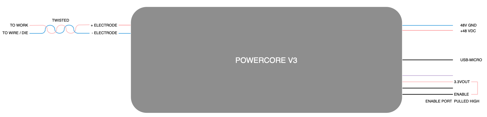

The minimum application example of the device:

| Input / Output | Connection Requirements |
| --- | --- |
| Power Input | Connected to 48V, 300W PSU via 16 AWG stranded wire |
| USB-MICRO | Connected to USB PSU or PC. Note: The 48V supply must be connected first, before the USB-micro, or else the device will enter fault mode. This is because the Pico module boots up and does not sense that input power is supplied to the device. |
| Enable Port | Pulled high to 3.3V, after the device is connected to 48V and USB power. |
| Power Output | Positive (+) electrode is connected to workpiece, and negative (-) electrode is connected to the cutting electrode (wire or die) |

## EMC & EMI

The Powercore V3 power supply unit is housed in a precision-machined, billet-aluminum enclosure, fully grounded to minimize electromagnetic interference. When no output cables are connected, radiated emissions are negligible. However, when output cables are attached, radiated emissions vary based on cable characteristics, including length, twist, and wire gauge.

To ensure optimal performance and compliance with electromagnetic compatibility standards, output cables must be shielded, grounded, and twisted. Poorly designed or unshielded cables may increase radiated emissions, potentially interfering with sensitive external electronic equipment.

When implemented, the machining setup should be fully enclosed, shielded, and grounded to further reduce electromagnetic interference and ensure reliable operation. It is the responsibility of the installer to implement these EMC measures.

## Images of PCBA

### PCBA View 1
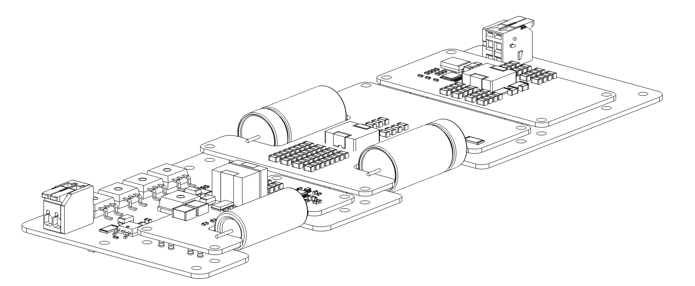

### PCBA View 2


### PCBA View 3
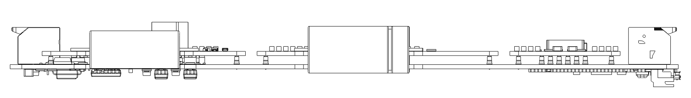

### PCBA View 4
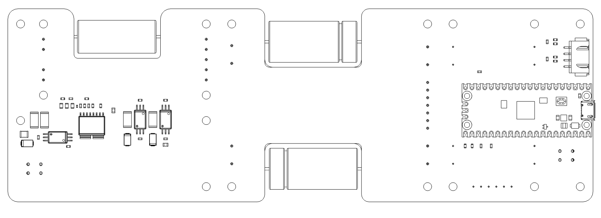

## Typical PSU Waveforms

### Output Stage Switch Control
Normal behavior of output stage switches during EDM iso-frequency mode. The enable (yellow trace) and high-current phase (red trace) switches are both active at the same time, permitting current flow from the positive electrode to the negative electrode. The high-voltage switch is active several microseconds before each switching event, for the purpose of charging the output capacitor to the spark initiation voltage (blue trace).

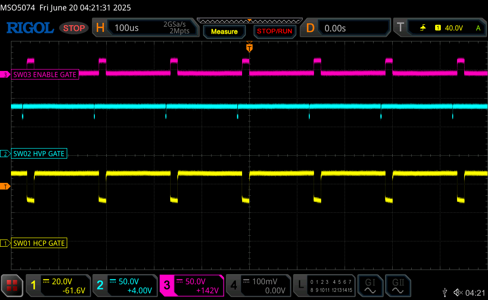

### Gap Voltage with Electrodes Separated
Normal behavior of output stages during EDM iso-frequency mode, with the electrodes separated by several millimeters under distilled water. The positive (+) electrode (red trace) shows the change in gap voltage when the output capacitor is charged and then slowly discharged through the water.

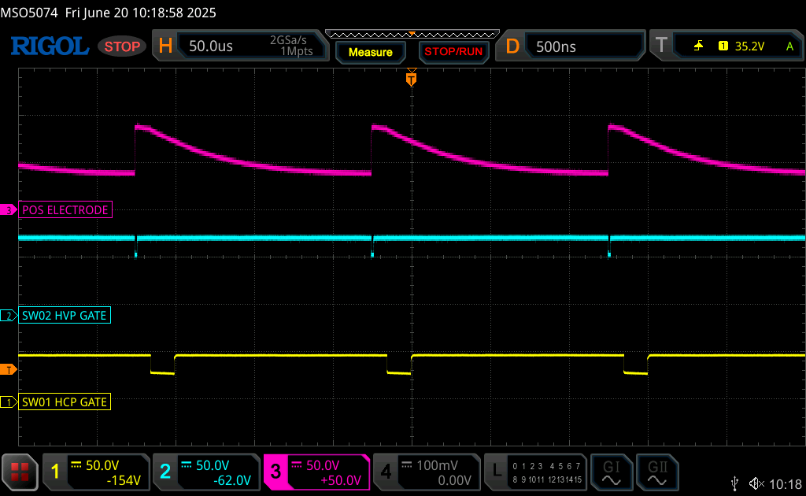

### EDM Discharge Behavior
Normal behavior of output stages during EDM iso-frequency mode, during electrical discharge machining. The positive (+) electrode voltage changes rapidly during an EDM discharge; transitioning from the spark initiation voltage (here 80V) to the gap machining voltage (~40V) in several hundred nanoseconds.

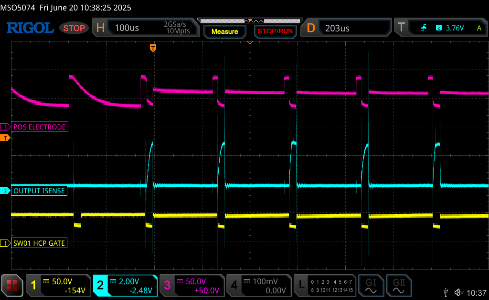

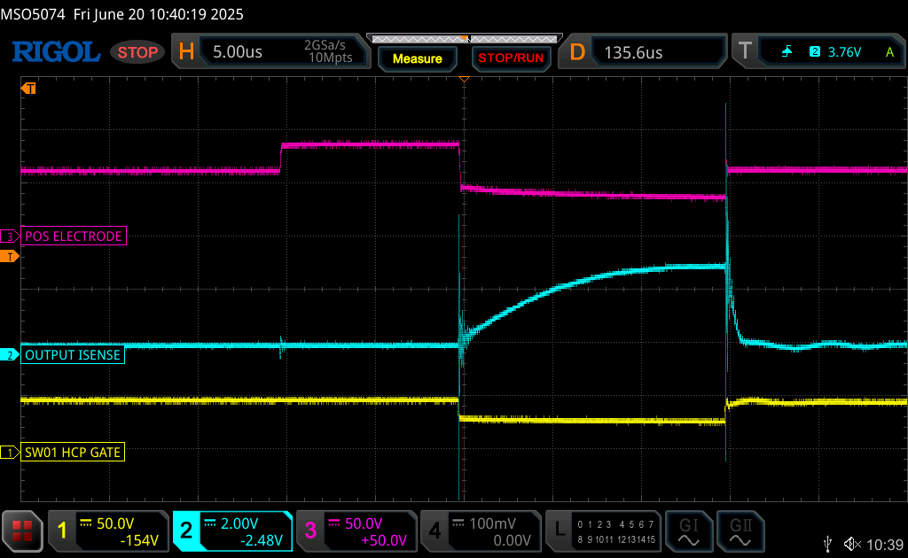

### Boost Converter Operation
Normal behavior of the boost converter module. The MOSFET gate (blue trace) presents with short pulses, which are used to maintain a stable output voltage. The output voltage will be set by the I2C digital potentiometer to between 64 and 150 V.

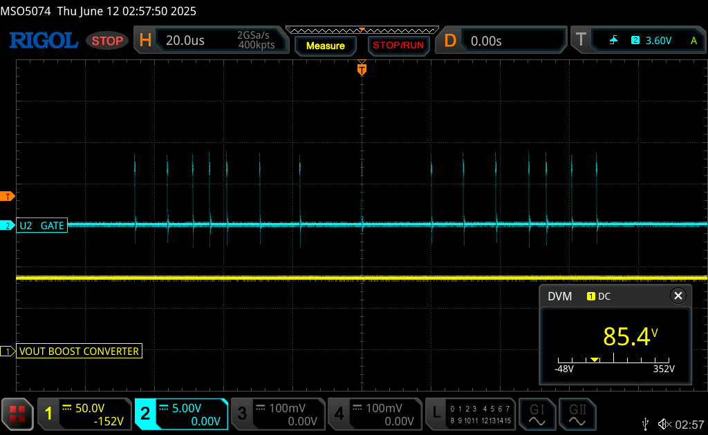

Startup behavior of device. Two seconds are required for inrush protection and serial communication initiation. Subsequently, the boost converter and output voltage sensor collaborate to create the lookup table for the I2C digital potentiometer. Once the lookup table is constructed, the boost converter is set to its default 80V setting.

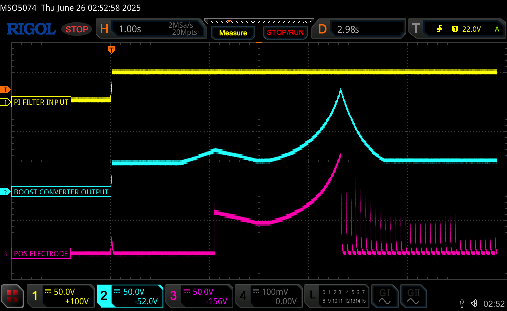

## LICENSE 
The Powercore V3 2025 by Rack Robotics, Inc. is licensed under the Creative Commons Attribution-NonCommercial-ShareAlike 4.0 International License (CC BY-NC-SA 4.0).

### You are free to:
- **Share** — copy and redistribute the material in any medium or format
- **Adapt** — remix, transform, and build upon the material

### Under the following terms:
- **Attribution** — You must give appropriate credit, provide a link to the license, and indicate if changes were made
- **NonCommercial** — You may not use the material for commercial purposes
- **ShareAlike** — If you remix, transform, or build upon the material, you must distribute your contributions under the same license as the original
- **No additional restrictions** — You may not apply legal terms or technological measures that legally restrict others from doing anything the license permits

### Notices:
You do not have to comply with the license for elements of the material in the public domain or where your use is permitted by an applicable exception or limitation.

No warranties are given. The license may not give you all of the permissions necessary for your intended use. For example, other rights such as publicity, privacy, or moral rights may limit how you use the material.

For the full license text, see: https://creativecommons.org/licenses/by-nc-sa/4.0/

This includes all hardware designs, firmware, documentation, and associated files in this repository. Commercial use requires explicit written permission from the project maintainers. 

### Trademark
The name 'Powercore' and 'Rack Robotics' are property of Rack Robotics, Inc. and are only to be used by Rack Robotics, Inc. Any derivative works must remove both marks unless written permission to use either or both marks is provided by Rack Robotics, Inc.

## ⚠️ HIGH VOLTAGE SAFETY WARNING ⚠️

**DANGER - HIGH VOLTAGE PRESENT**
This device generates and outputs high-voltage DC, which could be hazardous. Before operating, building, or servicing this equipment, read and understand all safety warnings.

ELECTRICAL HAZARDS
- **DANGEROUS VOLTAGES PRESENT**: Output voltages up to 150V DC can cause electrical shock or burns
- **STORED ENERGY**: Internal capacitors retain dangerous voltages even when power is disconnected
- **DISCHARGES**: High-energy discharges can cause burns, eye damage, and ignite flammable materials

LEGAL DISCLAIMER
- Users assume all responsibility for safe operation and compliance with local electrical codes
- This equipment is intended for use by qualified professionals only
- Improper use may result in serious injury, death, or property damage
- The manufacturer disclaims all liability for injuries or damages resulting from improper use
**IF YOU ARE NOT QUALIFIED TO WORK WITH HIGH-VOLTAGE EQUIPMENT, DO NOT PROCEED**