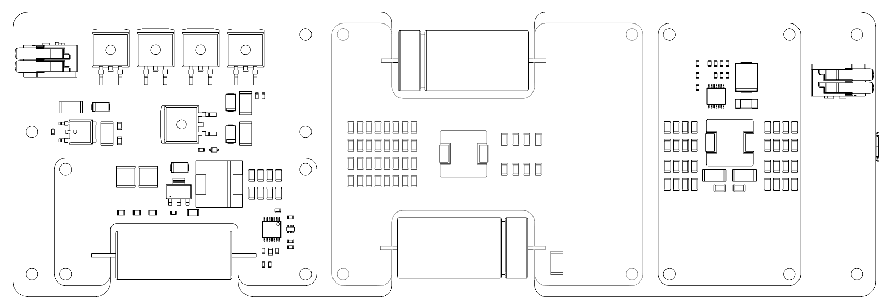

# Powercore V3

A high-efficiency power supply unit designed for Electrical Discharge Machining (EDM) applications.

## Repository Structure

- `circuit-boards/` - KiCAD PCB designs for all modules
- `schematics/` - Schematic PDFs for electronics
- `KiCAD-library/` - Custom component library and 3D models
- `LTSpice/` - Simulation files
- `powercoreV3-firmware/` - Arduino firmware for the RP2040 controller

## Table of Contents

- [PSU HIGHLIGHTS](#psu-highlights)
- [FEATURES](#features)
- [APPLICATIONS](#applications)
- [GENERAL DESCRIPTION](#general-description)
- [SPECIFICATIONS](#specifications)
- [Recommended Operating Conditions](#recommended-operating-conditions)
- [DEVICE INTERFACES](#device-interfaces)
  - [Power Input Connector](#power-input-connector)
  - [Power Output Connector](#power-output-connector)
  - [Digital Interface Connector](#digital-interface-connector)
  - [USB-Micro Serial Interface](#usb-micro-serial-interface)
- [THEORY OF OPERATION](#theory-of-operation)
- [OPERATION MODES](#operation-modes)
  - [Startup Behavior](#startup-behavior)
  - [Idle Mode](#idle-mode)
  - [Iso-Frequency Mode](#iso-frequency-mode)
  - [Edge-Detection Mode](#edge-detection-mode)
- [APPLICATION EXAMPLE: MINIMUM IMPLEMENTATION](#application-example-minimum-implementation)
- [EMC & EMI](#emc--emi)
- [Images of PCBA](#images-of-pcba)
- [Typical PSU Waveforms](#typical-psu-waveforms)
- [LICENSE](#license)
- [⚠️ HIGH VOLTAGE SAFETY WARNING ⚠️](#️-high-voltage-safety-warning-️)

## PSU HIGHLIGHTS

1. Optimized for wire EDM applications
2. Maximum input power: 300W with high efficiency topology
3. Adjustable output parameters:
   - Machining Duty Cycle: 1% to 15%
   - Spark Initiation Voltage: 64V to 150V
   - Machining Frequency: 5kHz to 20kHz
4. USB serial interface for configuration and telemetry
5. PWM feedback output for external feedrate control
6. Edge detection capability for workpiece probing


## FEATURES

- **Dual-Converter Topology** with resonant converter and boost converter for high-efficiency EDM machining
- Input power optimized for desktop/micro-scale wire EDM (300W maximum, 48V input)
- Output parameters configurable via USB-micro serial interface
- Integrated protection features: pulse-skipping, overcurrent protection, and inrush protection
- Open-source electronics, firmware, and CAD files

## APPLICATIONS

- Wire EDM
- Plunge EDM
- Desktop-scale EDM machines
- Portable and battery-powered EDM machines
- Scientific research and development

## GENERAL DESCRIPTION

The Powercore V3 provides precision control of machining parameters including duty cycle, spark initiation voltage, and machining frequency. The system is optimized for desktop-scale wire EDM applications. The open-source design enables customization for research, development, and specialized EDM implementations.

## SPECIFICATIONS

| SPECIFICATION | Min | Max Value | UNIT |
| --- | --- | --- | --- |
| Average Input Power | 10 | 300 | W |
| Input Voltage | 47.8 | 48.2 | V |
| Input Current | 0.625 | 6.25 | A |
| Machining Duty Cycle | 1 | 15 | % |
| Spark Initiation Voltage | 64 | 150 | V |
| Machining Frequency | 5,000 | 20,000 | Hz |
| Machining Current (1) | 40 | 70 | A |
| PWM Feedback Duty Cycle | 0 | 100 | % |
| PWM Feedback Voltage | 0 | 3.3 | V |
| PWM Feedback Frequency  | — | 10,000 | Hz |
| PWM Feedback Output Impedance | 1,010 | 9,990 | Ω |
| Enable Input Voltage | 3.0 | 3.5 | V |
| Enable Input Impedance | 1,010 | 9,990 | Ω |

(1) Machining current depends on output cable impedance and discharge characteristics. Not regulated by constant-current control. Lower-impedance output cables provide higher machining current.

## Recommended Operating Conditions

| Parameter | Value |
| --- | --- |
| Ambient Temperature | 0°C to 30°C |
| Ingress Protection Rating | IP20 (Indoor use) |
| Relative Humidity | 20% to 80% (non-condensing) |
| Input Cable Gauge | 16 AWG minimum |
| Output Cable Gauge | 16 AWG stranded, 300V rated |
| Output Cable Length | <1 meter, twisted pair |
| Cooling | Forced air cooling recommended |

## DEVICE INTERFACES


### POWER INPUT CONNECTOR

Input power connects via 2-position lever-action Wago connector accepting 16 AWG conductors. 48VDC input must be connected before applying 5V via USB-micro. If USB power is applied before 48VDC input, the microcontroller enters fault mode.

### POWER OUTPUT CONNECTOR 

Output connects via 2-position lever-action Wago connector accepting 16 AWG stranded conductors. Output cable must be twisted pair, <1 meter length, and either shielded/grounded or contained within a shielded/grounded enclosure.

### DIGITAL INTERFACE CONNECTOR 

4-position JST-XH header provides communication with external controllers. Exposes 3.3V and GND from RP2040 microcontroller with current-limiting resistors.

- **Enable Input**: Output is enabled when this input is connected to 3.3V or external 3.3V supply with common ground. 10kΩ pull-down resistor to GND.
- **Feedback Output**: Reports discharge rate via active-low PWM signal. 100% duty cycle indicates open circuit; 0% indicates short circuit or power supply fault. Maintain 20-80% duty cycle during machining by adjusting feedrate. 10kΩ pull-down resistor to GND. External low-pass filter can convert to analog feedback.

### USB-MICRO SERIAL INTERFACE

Exposes USB-micro connector of RP2040 Pico module for parameter configuration and telemetry. Default baud rate: 115,200.

**Warning**: Device requires both 48VDC input power AND 5V USB power. 48VDC must be connected first, or device enters fault mode.

| SERIAL COMMAND | DESCRIPTION |
| --- | --- |
| SEND_TELEMETRY | Request device status and parameters |
| SET_ALL_PARAMETERS | Configure machining parameters: discharges, duty cycle, frequency, initiation voltage<br>Format: 'SET_ALL_PARAMETERS [discharges] [duty_cycle] [frequency] [voltage]'<br>Example: 'SET_ALL_PARAMETERS 0 0.10 5000 100' |
| EDM_ISOFREQUENCY_MODE | Enter EDM iso-frequency mode |
| EDGE_DETECTION_MODE | Enter edge detection mode |
| RESET_DEVICE | Reset device |

Invalid commands return list of valid commands.

## THEORY OF OPERATION

The Powercore V3 generates controlled electrical discharges for EDM machining. The system cycles through spark initiation, current delivery, and discharge termination at high frequency (5-20kHz).

**Spark Initiation Voltage**: Determines spark formation conditions. Higher voltages create longer, more intense discharges suitable for harder materials.

**Machining Duty Cycle**: Controls discharge duration. Longer duty cycles increase material removal rate but may increase surface roughness.

**Machining Frequency**: Sets discharge repetition rate. Lower frequencies can increase material removal rate but may reduce surface finish quality.

**Machining Current**: Ranges from 40A to 70A, determined by fixed 48VDC output during current phase and combined impedance of output cables and discharge gap. Current is not user-adjustable.

## OPERATION MODES

### STARTUP BEHAVIOR 

On power-up, output is disabled (high-impedance state). Power management module initializes and pi-filter capacitors charge to 48V with inrush protection. Brief audible noise (~1 second) is normal during startup. Output current sensor calibrates and serial communication establishes.

**BOOST CONVERTER SELF-TEST**: System tests boost converter module and I2C digital potentiometer. If I2C communication fails, device reports 'ERROR: DPOT is not at expected position'. 

During startup, digital potentiometer cycles through settings 0-110, generating boost converter output voltage lookup table (50V-160V). If voltage range is insufficient, device enters fault mode and reports 'ERROR: DPOT voltage range is less than expected'.

Normal startup sequence via serial:
```
Setting DPOT to minimum position...
Waiting for voltage to stabilize...
Reading voltages for DPOT lookup table...
Boost Converter Digital Potentiometer Voltage Table:
0: 51
1: 52
...
109: 161
110: 166
```

Successful startup indicated by solid green LED and "Setup complete" message. Device enters IDLE mode.

### IDLE MODE

Output remains in high-impedance state until enable input is asserted (3.3V). No discharges occur in idle mode.

### ISO-FREQUENCY MODE

Fixed-frequency discharge mode. Default mode or activated via 'EDM_ISOFREQUENCY_MODE' command. //AI, note here that the default parameters are 10KHz 10% duty cycle and 80V. Enable input must be asserted (3.3V) to begin operation.

**ISO-FREQUENCY MODE PARAMETERS**

| PARAMETER | Min | Default | Max | Unit |
| --- | --- | --- | --- | --- |
| Machining Duty Cycle | 1 | 10 | 15 | % |
| Machining Frequency | 5,000 | 10,000 | 20,000 | Hz |
| Spark Initiation Voltage | 64 | 80 | 150 | V |

### EDGE-DETECTION MODE

Probe mode for detecting electrode-workpiece contact via PWM feedback. Intended for setup and calibration only, not for machining. Activated via 'EDGE_DETECTION_MODE' command with enable input asserted.

## APPLICATION EXAMPLE: MINIMUM IMPLEMENTATION


Minimum system configuration:

| Connection | Requirements |
| --- | --- |
| Power Input | 48V, 300W supply via 16 AWG stranded wire |
| USB-Micro | 5V supply or PC connection. **Note**: 48V must be connected first |
| Enable Input | Connect to 3.3V after power supplies are connected |
| Power Output | Positive (+) to workpiece, negative (-) to electrode (wire/tool) |

## EMC & EMI

The Powercore V3 power supply unit is housed in a precision-machined, billet-aluminum enclosure, fully grounded to minimize electromagnetic interference. When no output cables are connected, radiated emissions are negligible. However, when output cables are attached, radiated emissions vary based on cable characteristics, including length, twist, and wire gauge.

**Requirements**: Output cables must be shielded, grounded, and twisted. Poor cable design may increase emissions and interfere with sensitive equipment.

**Installation**: Complete machining setup should be enclosed, shielded, and grounded. EMC compliance is installer's responsibility.

## Images of PCBA

### PCBA View 1


### PCBA View 2


### PCBA View 3


### PCBA View 4


## Typical PSU Waveforms

### Output Stage Switch Control
Normal behavior of output stage switches during EDM iso-frequency mode. The enable (yellow trace) and high-current phase (red trace) switches are both active at the same time, permitting current flow from the positive electrode to the negative electrode. The high-voltage switch is active several microseconds before each switching event, for the purpose of charging the output capacitor to the spark initiation voltage (blue trace).


### Gap Voltage with Electrodes Separated
Normal behavior of output stages during EDM iso-frequency mode, with the electrodes separated by several millimeters under distilled water. The positive (+) electrode (red trace) shows the change in gap voltage when the output capacitor is charged and then slowly discharged through the water.


### EDM Discharge Behavior
Normal behavior of output stages during EDM iso-frequency mode, during electrical discharge machining. The positive (+) electrode voltage changes rapidly during an EDM discharge; transitioning from the spark initiation voltage (here 80V) to the gap machining voltage (~40V) in several hundred nanoseconds.


### Boost Converter Operation
Normal behavior of the boost converter module. The MOSFET gate (blue trace) presents with short pulses, which are used to maintain a stable output voltage. The output voltage will be set by the I2C digital potentiometer to between 64 and 150 V.


Startup behavior of device. Two seconds are required for inrush protection and serial communication initiation. Subsequently, the boost converter and output voltage sensor collaborate to create the lookup table for the I2C digital potentiometer. Once the lookup table is constructed, the boost converter is set to its default 80V setting.


## LICENSE 
The Powercore V3 2025 by Rack Robotics, Inc. is licensed under the Creative Commons Attribution-NonCommercial-ShareAlike 4.0 International License (CC BY-NC-SA 4.0).

### You are free to:
- **Share** — copy and redistribute the material in any medium or format
- **Adapt** — remix, transform, and build upon the material

### Under the following terms:
- **Attribution** — You must give appropriate credit, provide a link to the license, and indicate if changes were made
- **NonCommercial** — You may not use the material for commercial purposes
- **ShareAlike** — If you remix, transform, or build upon the material, you must distribute your contributions under the same license as the original
- **No additional restrictions** — You may not apply legal terms or technological measures that legally restrict others from doing anything the license permits

### Notices:
You do not have to comply with the license for elements of the material in the public domain or where your use is permitted by an applicable exception or limitation.

No warranties are given. The license may not give you all of the permissions necessary for your intended use. For example, other rights such as publicity, privacy, or moral rights may limit how you use the material.

For the full license text, see: https://creativecommons.org/licenses/by-nc-sa/4.0/

This includes all hardware designs, firmware, documentation, and associated files in this repository. Commercial use requires explicit written permission from the project maintainers. 

### Trademark
The name 'Powercore' and 'Rack Robotics' are property of Rack Robotics, Inc. and are only to be used by Rack Robotics, Inc. Any derivative works must remove both marks unless written permission to use either or both marks is provided by Rack Robotics, Inc.

## ⚠️ HIGH VOLTAGE SAFETY WARNING ⚠️

**DANGER - HIGH VOLTAGE PRESENT**
This device generates and outputs high-voltage DC, which could be hazardous. Before operating, building, or servicing this equipment, read and understand all safety warnings.

ELECTRICAL HAZARDS
- **DANGEROUS VOLTAGES PRESENT**: Output voltages up to 150V DC can cause electrical shock or burns
- **STORED ENERGY**: Internal capacitors retain dangerous voltages even when power is disconnected
- **DISCHARGES**: High-energy discharges can cause burns, eye damage, and ignite flammable materials

LEGAL DISCLAIMER
- Users assume all responsibility for safe operation and compliance with local electrical codes
- This equipment is intended for use by qualified professionals only
- Improper use may result in serious injury, death, or property damage
- The manufacturer disclaims all liability for injuries or damages resulting from improper use
**IF YOU ARE NOT QUALIFIED TO WORK WITH HIGH-VOLTAGE EQUIPMENT, DO NOT PROCEED**